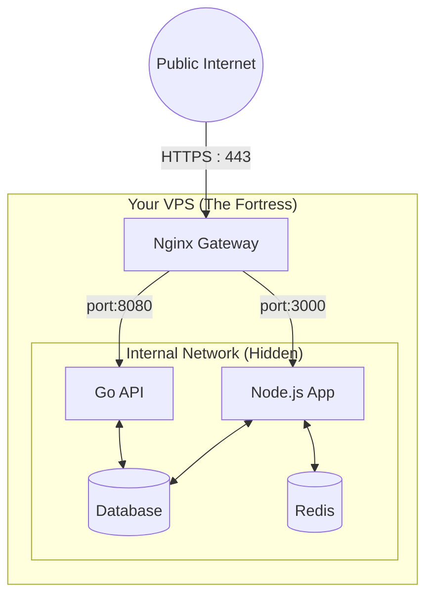

The modern developer stack often defaults to Vercel, Netlify, or AWS Lambda. It's easy, fast, and free—initially. But as side projects grow into real businesses, the unpredictable pricing and "cold start" latency can become major bottlenecks.

There is an alternative that is often feared but incredibly powerful: **Self-Hosting on a VPS (Virtual Private Server)**.

In this guide, I'll walk you through how to take a $5/month Linux server and turn it into a production-grade container orchestration platform that rivals managed services.

## The Myth of "Serverless is Simpler"

Serverless abstracts away servers, but it introduces new complexity:
- **Vendor Lock-in**: Your code often relies on specific cloud triggers.
- **Cold Boot**: The 500ms-2s delay when a function wakes up.
- **Connection Limits**: Serverless functions often exhaust database connection pools.

On a VPS, your application is always alive, always warm, and you have Full Control.

## Architecture: The "Fortress" Approach

The goal is to securely host multiple Docker containers (App, Database, Cache) on one machine without exposing them to the world.

We use a **Reverse Proxy** pattern.



### 1. The Gateway (Nginx)

Instead of exposing your Node.js app directly on port 3000 (which is insecure), we place Nginx at the front. Nginx handles:
- **SSL Termination**: Automating HTTPS certificates with Let's Encrypt.
- **Security Headers**: Block XSS and clickjacking attacks before they reach your app.
- **Load Balancing**: Routing `/api` to your backend and everything else to your frontend.

### 2. Container Orchestration (Docker Compose)

You don't need Kubernetes. For most applications, **Docker Compose** is enough. It allows you to define your infrastructure as code.

The secret to stability is **Resource Limiting**.

```yaml
  database:
    image: postgres:15
    restart: always
    deploy:
      resources:
        limits:
          cpus: '0.50' # Never let DB eat more than 50% CPU
          memory: 512M
```

Without this, a memory leak in one app could crash your database. With limits, Docker kills just the offending container, and `restart: always` brings it back in seconds.

## Database Management: The Scariest Part

The main reason people avoid VPS is database management. "What if I lose data?"

The solution is **Volume Mapping** + **Automated Backups**.
1.  Map your database data to the host: `- ./data/postgres:/var/lib/postgresql/data`.
2.  Run a simple cron job that dumps this folder to an S3 bucket or Google Drive every night.

This gives you the reliability of a managed database without the $150/month price tag.

## Automating Deployments (CI/CD)

Deploying to a VPS doesn't mean dragging and dropping files via FTP like it's 1999. You can use **GitHub Actions**.

1.  **Build**: GitHub builds your Docker image and pushes it to a private registry.
2.  **Trigger**: GitHub SSHs into your VPS.
3.  **Update**: It runs `docker compose pull && docker compose up -d`.

This "Rolling Update" strategy ensures your uptime remains 99.9% even during deployments.

## Conclusion

Self-hosting forces you to understand Linux, networking, and security. It's a steeper learning curve than `vercel deploy`.

But the reward is a system that costs a fixed amount ($5-20/mo), never sleeps, has zero cold starts, and is completely under your control. For many growing startups and serious projects, that trade-off is worth making.
