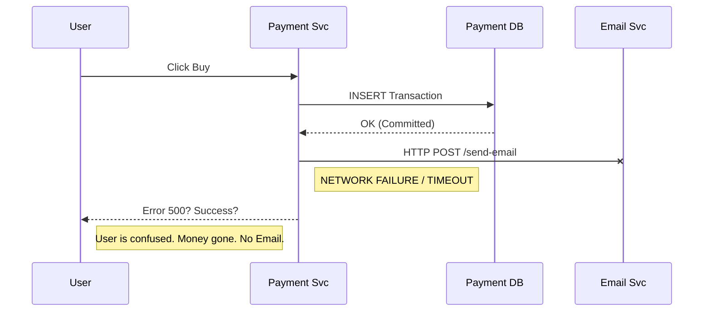
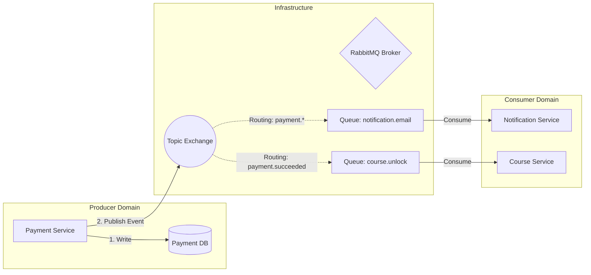
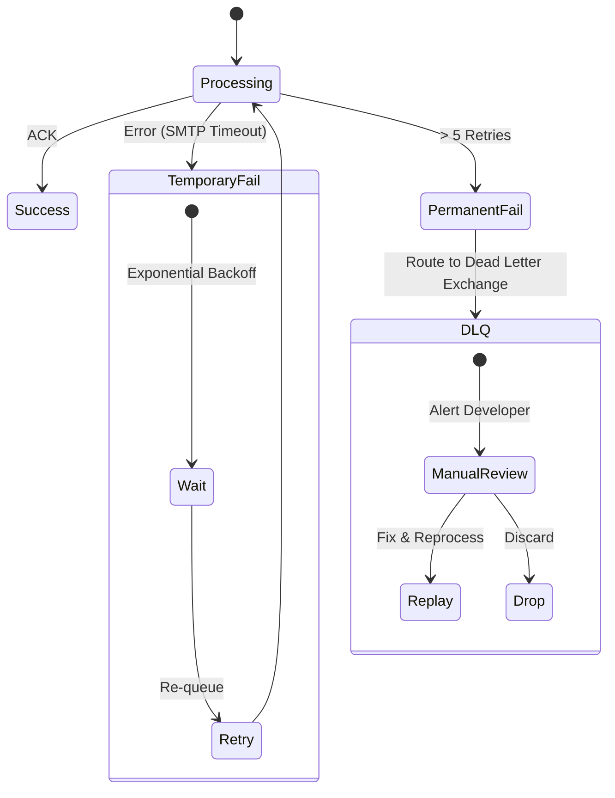

In a monolithic application, consistent data is easy: you wrap everything in a single database transaction. `BEGIN`, Insert A, Insert B, `COMMIT`. Done.

In a **Distributed Microservices** world, this guarantee evaporates. You cannot effectively "transaction" across two different services with separate databases (Distributed Transactions/2PC are often too slow for web scale).

This article details how we transitioned from a brittle, synchronous HTTP-based system to a robust **Event-Driven Architecture** using RabbitMQ as the central nervous system.

## The "Dual Write" Problem: A Recipe for Data Corruption

The most common mistake in microservices is the naive approach to coordinating actions.

```typescript
// ❌ The Naive Implementation (Synchronous Coupling)
async function completePurchase(user, amount) {
  // 1. Save to Payment DB (Transaction Committed)
  await paymentRepo.save({ user, amount });

  // 2. Call Notification Service API
  // 💥 CRITICAL RISK: If this line throws (Timeout, 500 Error, Power Failure)
  // The money is taken, but the user NEVER gets the email.
  await axios.post("http://notification-service/email", { user });
}
```

This leads to a system that is intimately coupled. If the Email Service goes down for maintenance, the **Purchase flow stops working**.

### Visualizing the Risk



## The Solution: Durable Event-Driven Architecture

We decouple the intent ("Payment Happened") from the execution ("Send Email"). The Payment service's _only_ responsibility is to record the payment and tell the world what happened.

### Architecture Overview

We utilize a **Publisher/Subscriber** model.



### 1. Robust Publishing (Go)

In our Golang payment service, we treat the **Event** as a first-class citizen. We use **Publisher Confirms** to guarantee the broker received the message.

```go
// Go: Ensuring Durability
// 1. Declare Durable Exchange (survives restarts)
ch.ExchangeDeclare("payment_events", "topic", true, ...)

// 2. Enable Publisher Confirms
ch.Confirm(false)
confirms := ch.NotifyPublish(make(chan amqp.Confirmation, 1))

// 3. Publish Persistent Message
ch.Publish(
    "payment_events",
    "payment.succeeded",
    false, false,
    amqp.Publishing{
        DeliveryMode: amqp.Persistent, // Writes to Disk
        ContentType:  "application/json",
        Body:         payload,
    }
)

// 4. Wait for ACK from RabbitMQ
if confirmed := <-confirms; !confirmed.Ack {
    return fmt.Errorf("Critical: Message lost by broker")
}
```

## Advanced Patterns: Reliability at Scale

### Fan-Out: The "Open/Closed" Principle

One of the greatest benefits of this architecture is extensibility.

When a `payment.succeeded` event occurs:

1.  **Notification Service** consumes it to send an email.
2.  **Course Service** consumes it to unlock the video.
3.  **Analytics** consumes it to update the revenue dashboard.

If we want to add a _Reward Service_ (Points system), we simply bind a new queue. **We do not touch the Payment Service code.**

### Handling Failure: The Dead Letter Queue (DLQ) Strategy

In an HTTP world, an error crashes the request immediately. In an async world, a "bad message" (e.g., malformed JSON) can crash the consumer loop repeatedly, blocking all other messages.

We implement a rigorous **Retry & DLQ** lifecycle.



1.  **Transient Errors** (Network glitch): We NACK with `requeue=true` (or use a delayed exchange).
2.  **Permanent Errors** (Buggy code): After 5 retries, RabbitMQ moves the message to `dlq.payment.notification`.
3.  **Human Intervention**: A developer inspects the DLQ, patches the bug, and uses a "Shovel" script to replay the messages.

## Conclusion

Moving to an Event-Driven architecture introduces infrastructure complexity (managing a Broker), but it buys you **Resilience** and **Decoupling**.

- **Reliability**: A downstream service outage never affects the core business transaction.
- **Observability**: The queue depth becomes a metric for system load.
- **Extensibility**: Features can be added by simply "listening" to the stream of events.

For a mission-critical platform handling real money and user access, this architectural rigor is not optional—it's essential.
