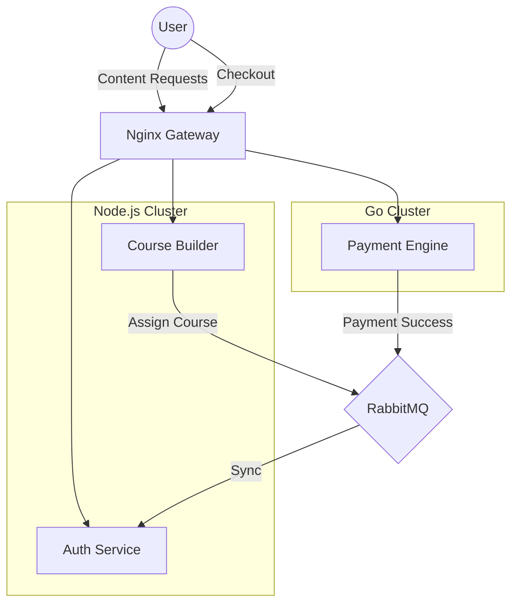

The "Golden Rule" of early startup engineering is often: **Stick to one stack.** If you write the frontend in TypeScript, write the backend in TypeScript. It minimizes context switching and simplifies hiring.

But as our platform grew from a simple CRUD app to a high-volume payment processor, we hit a ceiling. The same dynamic features that made Node.js perfect for our CMS were becoming a liability for our financial ledger.

This article details our journey into a **Polyglot Microservices Architecture**, specifically how and why we integrated **Go (Golang)** alongside our existing **Node.js** services.

## The Tale of Two Domains

To understand the decision, we must analyze the two distinct "Physics" of our application.

### Domain A: Content & Users (The "Soft" Domain)
- **Characteristics**: Highly relational data, deeply nested JSON structures, frequent schema changes (Marketing wants a new field yesterday), IO-bound.
- **The Best Tool**: **Node.js + NestJS/Express**.
- **Reasoning**: JavaScript's object flexibility and TypeORM's powerful relational mapping make handling complex course hierarchies (Course > Module > Lesson > Video > Quiz) a breeze.

### Domain B: Payments & Transactions (The "Hard" Domain)
- **Characteristics**: Immutable data, high concurrency (webhooks), CPU-bound (cryptographic signatures), zero tolerance for type errors.
- **The Best Tool**: **Go (Golang)**.
- **Reasoning**: Go's compile-time strictness and Goroutine model allow us to handle thousands of concurrent payment webhooks on a $5 server without blocking.

## Architectural Deep Dive

We didn't just spin up a separate server; we architected a symbiotic system where the two languages cover each other's blind spots.



### 1. Performance: Event Loop vs. Goroutines

Node.js runs on a **Single Thread**. If a webhook requires complex SHA-256 signature verification (common in Fintech), it blocks the Event Loop. If you receive 1000 webhooks at once, the 1000th request might time out before processing starts.

Go, conversely, spawns a lightweight **Goroutine** for every request.
```go
// Go handles 10,000 requests like a breeze
func HandleWebhook(c *fiber.Ctx) error {
    go func() {
        // Complex calculation happens here, off the main path
        VerifySignature(c.Body())
    }()
    return c.SendStatus(202) // Instant response
}
```

### 2. Type Safety: The Trillion Dollar Mistake

In Node.js/TypeScript, types are erased at runtime. You might define an interface `PaymentAmount`, but if the API sends a string `"100.00"` instead of a number `100`, your math might break silently (`"100.00" + 20` = `"100.0020"`).

In Go, this is impossible.
```go
type Payment struct {
    Amount int64 `json:"amount"` // Strict definition
}
// If JSON is string, Unmarshal fails instantly.
// Zero ambiguity.
```
This strictness is annoying for a CMS, but **vital** for a Ledger.

## The Glue: Shared Contracts

The danger of Polyglot is "Contract Drift"—Node expects `userId` (camelCase) but Go sends `user_id` (snake_case).

We solved this using **Shared JSON Schemas**.
1.  We define the Source of Truth in a `.proto` or JsonSchema file.
2.  **Generate TypeScript interfaces**: `npm run gen:types`
3.  **Generate Go Structs**: `go generate ./...`

This ensures that `PaymentSucceededEvent` looks identical in both codebases.

## Deployment Strategy: Docker Multistage

Deploying two languages requires a unified pipeline. We use Docker to abstract the underlying runtime.

**Node.js Dockerfile:**
- Heavy (`node_modules`).
- Optimized with multi-stage build to remove devDependencies.
- Image Size: ~150MB.

**Go Dockerfile:**
- Statically compiled binary.
- Built `FROM golang:alpine AS builder`.
- Copied to `FROM scratch`.
- Image Size: **~15MB**.

The Go containers are so small and fast to start (millis) that we can autoscale them aggressively during flash sales.

## The Trade-off: Development Friction

It's not all sunshine. Introducing a second language has costs:
1.  **Context Switching**: A developer working on the Course API (JS) feels "slowed down" when switching to the Payment API (Go) due to the verbose syntax.
2.  **Tooling Duplication**: We need two linters, two test runners, and two sets of CI pipelines.
3.  **Hiring**: Finding "Full Stack" developers is hard. Finding "Node + Go" Polyglots is harder.

## Conclusion: Use the Right Tool for the Right Job

We found the sweet spot:
- Use **Node.js** where you need **Velocity** and **Flexibility**.
- Use **Go** where you need **Stability** and **Throughput**.

For our EdTech platform, splitting the "Business Logic" from the "Money Logic" wasn't just an optimization; it was the key to sleeping soundly at night, knowing that while a UI bug might hide a button, it would never lose a dollar.
