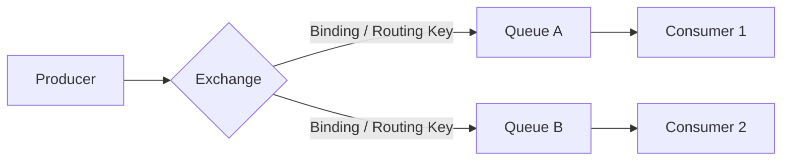
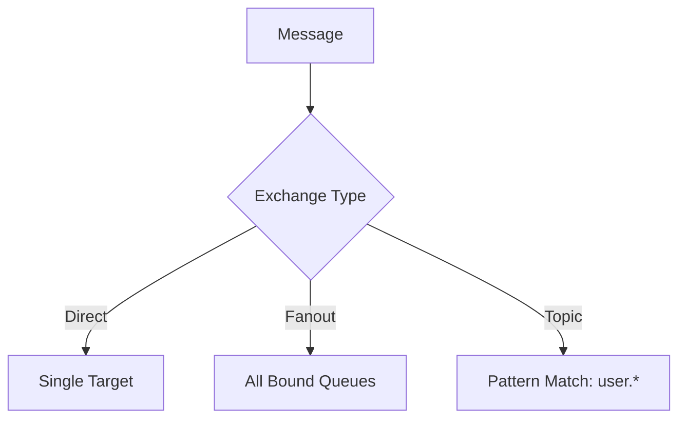
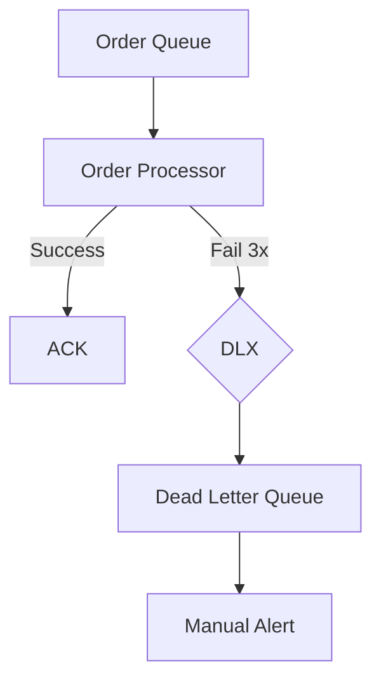

In a classic monolithic application, communication is simple: you call a function, it does some work, and returns a result. But in a **Microservices** world, services talk across a network. If Service A calls Service B and waits for a response (Synchronous), you create a brittle system where a failure in B cascades to A, potentially taking down your entire platform.

The solution to this "cascading failure" is **Event-Driven Architecture (EDA)**. And at the heart of many high-performance EDA implementations lies **RabbitMQ**.

## 1. What is Event-Driven Architecture (EDA)?

EDA is a software architecture pattern where the flow of the program is determined by **Events**—significant changes in state (e.g., `UserSignedUp`, `PaymentProcessed`, `CourseCompleted`).

### The Three Pillars of EDA:
1.  **Decoupling:** The "Signup Service" shouldn't know that an "Email Service" exists. It simply announces that a signup occurred.
2.  **Scalability:** You can easily add more listeners (e.g., a "Marketing Service") without touching a single line of the Signup Service code.
3.  **Resilience:** If the Email Service is down, the message stays safely in the queue. When the service recovers, it processes the pending work. The user never sees an error.

## 2. RabbitMQ: The Postal Service for Data

RabbitMQ is a message broker that implements the Advanced Message Queuing Protocol (AMQP). Think of it as a sophisticated postal service.

### Core Anatomy:
- **Producer:** The app sending the message (The sender).
- **Exchange:** The mail room. It receives messages and decides where to route them.
- **Queue:** The mailbox. Where messages wait to be picked up.
- **Consumer:** The app processing the message (The recipient).
- **Binding:** The rules connecting an Exchange to a Queue.

## 3. Mastering Exchange Types

The true power of RabbitMQ lies in its routing flexibility. Unlike simple "Point-to-Point" queues, RabbitMQ uses four types of Exchanges to handle different logic.

### A. Direct Exchange
Routes messages to queues based on an **Exact Match** of the routing key.
*   **Best for:** Unicasting. Sending an `error` log to an `error-processor` queue.

### B. Fanout Exchange
Broadcasts messages to **Every** queue bound to it. It ignores the routing key.
*   **Best for:** Broad-scale updates. A news alert that every user should receive.

### C. Topic Exchange
The most versatile. Routes based on wildcard patterns. 
- `*` matches exactly one word.
- `#` matches zero or more words.
*   **Best for:** Complex systems like an IoT platform routing data from `region.building.sensor`.

### D. Headers Exchange
Routes based on message headers instead of routing keys.
*   **Best for:** Routing based on complex metadata (e.g., File format, priority).

## 4. Building for Reliability: Don't Lose a Single Bit

In production (especially in fintech or e-commerce), losing a message means losing money. RabbitMQ provides several reliability layers.

### A. Message Acknowledgment (Ack)
A consumer must send back an "Acknowledgment" to RabbitMQ. If the consumer crashes before sending the Ack, RabbitMQ re-queues the message for another worker.

### B. Persistence (Durable & Persistent)
- **Durable Queue:** The queue survives a RabbitMQ server reboot.
- **Persistent Message:** The individual message is saved to disk.

### C. Dead Letter Queues (DLQ)
When a message fails processing multiple times (e.g., due to a logic error), it shouldn't block the queue. RabbitMQ sends it to a **Dead Letter Exchange** following a set of failures.

## 5. Advanced Patterns: The Saga and RPC

### The Saga Pattern (Distributed Transactions)
In microservices, you can't use SQL transactions across services. You use Sagas.
1. `Order Service` places order.
2. `Payment Service` charges card.
3. If payment fails, `Order Service` is notified via event to cancel the order.

### Remote Procedure Call (RPC)
Sometimes you need a synchronous response over RabbitMQ.
1. Client sends request with a `reply_to` queue name and a `correlation_id`.
2. Server processes and sends response to the `reply_to` queue with the same `id`.

## 6. Throughput and Scaling Workers

One of the best features of RabbitMQ is its ability to distribute work. If you have 10,000 images to process, you don't need a faster server; you just need **more workers**.

### Round-Robin Distribution
By default, RabbitMQ sends each message to the next consumer in a sequence.

### Fair Dispatch (Prefetch Count)
Tell RabbitMQ: "Don't give me a new message until I've finished the current one." This ensures that a fast worker isn't sitting idle while a slow worker is overwhelmed.

## 7. Monitoring and Troubleshooting

> [!INFO]
> The **RabbitMQ Management Plugin** is your best friend. It provides a web UI to see queue lengths, message rates, and consumer health.

**Common Red Flags:**
- **High "Unacked" Count:** Your consumers are hanging or not acknowledging messages.
- **Growing Queue Length:** Your consumers can't keep up with the producers. Time to scale!

## 8. Real-world Case Study: The E-Learning Flow

Imagine a student completing a course:
1.  **Course Service** emits `course.completed`.
2.  **Certificate Service** hears it, generates a PDF, and saves it.
3.  **Notification Service** hears it, sends an email with the PDF.
4.  **Admin Service** hears it, updates the student's record for HR.

If the "Email Service" is slow, the "Certificate" is still generated instantly. The user sees "Congratulations!" and the email arrives 10 seconds later.

## 9. Best Practices for Developers

1.  **Idempotency:** Assume messages will be delivered more than once. Always check if a transaction has already been processed before doing it again.
2.  **Small Messages:** Don't send a 10MB image through RabbitMQ. Send the **URL** to the image in S3/BunnyCDN.
3.  **Connection Pooling:** Creating a connection is expensive. Open a connection once and use **Channels** for individual tasks.

## 10. Conclusion: Why Unicorns Love RabbitMQ

Companies like **Tinder, Robinhood, and WeWork** use RabbitMQ to handle massive distribution. It provides the "shock absorption" necessary for systems to survive traffic spikes and network instability.

By mastering RabbitMQ, you aren't just learning "how to send messages." You are learning how to build **Resilient Distributed Systems**.

### FAQ

RabbitMQ vs Kafka: Which is better?

RabbitMQ is better for complex routing and "point-to-point" tasks. Kafka is better for high-throughput log streaming and "Replay" capability. For most microservices, RabbitMQ is simpler and more flexible.

How many messages can RabbitMQ handle?

In a single node, easily 20,000+ messages per second. In a cluster, it can handle hundreds of thousands.

What happens if the queue is full?

You can set a "Max Length." Once reached, RabbitMQ can either drop old messages or return an error to the producer.

_Next in our System Design series: Ship to Scale - The Kubernetes Journey._
