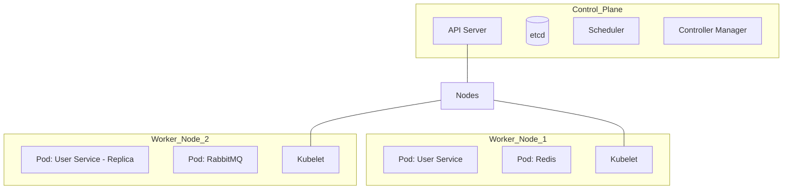
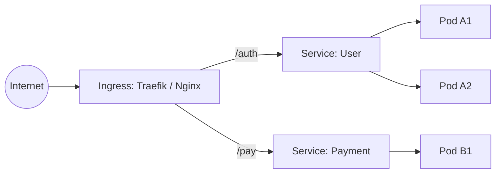
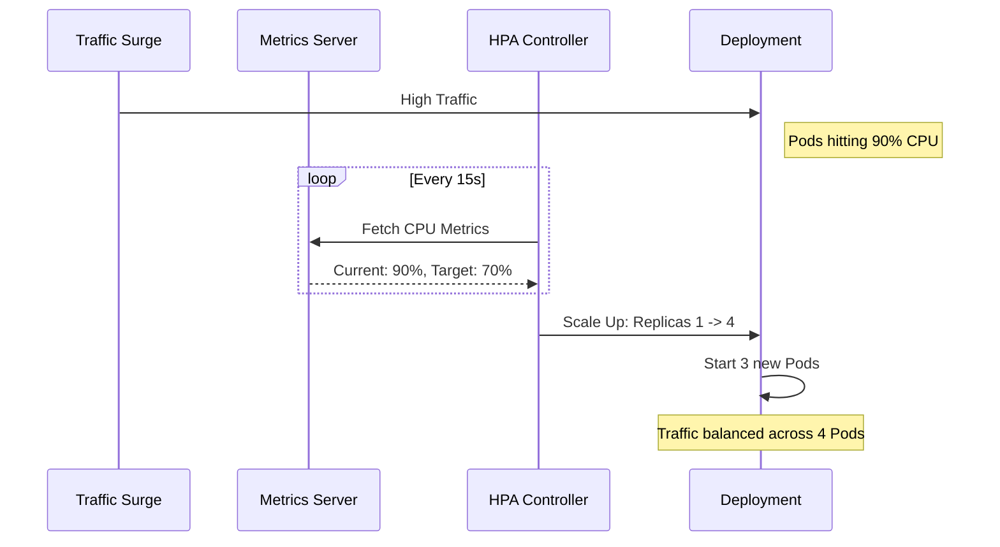

You've built your microservices, integrated Redis for caching, and RabbitMQ for event-driven magic. Everything works perfectly on your machine with `docker-compose`. But then comes the real world. Your user base doubles overnight. A marketing campaign brings 10x more traffic. Suddenly, your single VPS is gasping for air.

Manually running `docker-compose up --scale` on a SSH terminal at 3 AM is not a strategy—it's a nightmare. This is where **Kubernetes (K8s)** transforms you from a "Developer" into a "Cloud Native Engineer."

## 1. The Scaling Problem: Why Containers Aren't Enough

Containers (Docker) solved the "it works on my machine" problem. But they don't solve the "it works at scale" problem. 

**Without Orchestration, you have to manually handle:**
- **Placement:** Which server has enough RAM for this container?
- **Restarts:** What happens if the container crashes?
- **Routing:** How do you update the load balancer every time a container's IP changes?
- **Scaling:** How do you add replicas in response to real-time CPU spikes?

Kubernetes is the "Operating System for the Cloud" that automates all of this.

## 2. Kubernetes Architecture: The Brain and the Muscle

Kubernetes follows a **Master-Worker** architecture. Understanding this is key to understanding how your app stays alive.

### The Control Plane (The Brain)
- **API Server:** The front door. Every command goes through here.
- **Etcd:** The source of truth. A distributed database storing the entire cluster state.
- **Scheduler:** The "Traffic Controller." It decides which node should run which Pod.
- **Controller Manager:** The "Watchdog." It ensures the current state matches the desired state.

### The Worker Nodes (The Muscle)
- **Kubelet:** The agent that talks to the Master and manages local containers.
- **Kube-Proxy:** Manages the network rules (IP tables) for traffic routing.
- **Container Runtime:** (Usually `containerd`) What actually runs the container.



## 3. The Front Door: Ingress and Traffic Management

In Kubernetes, you don't expose Pods directly. You use **Services** and **Ingress**.

### A. The Service object
A stable IP and DNS name that points to a group of Pods. It provides internal load balancing.

### B. The Ingress Controller
The entry point from the internet. It handles:
- **SSL Termination:** Your app doesn't need to worry about HTTPS certificates.
- **Path-based Routing:** `/api/auth` goes to User Service, `/api/payments` goes to Payment Service.
- **Rate Limiting:** At the edge, before it even hits your code.



## 4. The "Holy Grail": Horizontal Pod Autoscaler (HPA)

HPA is what separates the boys from the men in infrastructure design. It allows your app to scale **Dynamically** based on load.

### The Feedback Loop:
1.  **Metrics Server** collects resource data (CPU/RAM) from every pod every 15 seconds.
2.  **HPA Controller** compares the current usage to your target (e.g., 70% CPU).
3.  **Calculation:** If usage > 70%, calculate how many more pods are needed.
4.  **Action:** Update the Deployment's `replica` count.



## 5. Deployment Strategies: Zero Downtime

Updating a monolith often involves service interruption. In K8s, we use:

### Rolling Updates
K8s stops the old pod only after the new pod has passed its **Readiness Probe**. This ensures your users never see a 404 or 502 error during a deployment.

### Blue-Green Deployments
Run the new version in a separate "Green" environment. Once tested, flip the Ingress routing to point to Green.

## 6. Persistence: Databases on K8s

Containers are meant to be "Stateless." But your database needs to keep its data.
- **PersistentVolume (PV):** A piece of storage (e.g., a disk on your VPS or a Cloud Disk).
- **PersistentVolumeClaim (PVC):** A "ticket" a Pod uses to request storage.

```yaml
# Simplified PVC Example
apiVersion: v1
kind: PersistentVolumeClaim
metadata:
  name: postgres-pvc
spec:
  accessModes:
    - ReadWriteOnce
  resources:
    requests:
      storage: 10Gi
```

## 7. Security: Secrets and ConfigMaps

Never store credentials in your Docker image!
- **ConfigMap:** Public configuration (e.g., `PORT: 3000`).
- **Secrets:** Base64 encoded sensitive data (`DB_PASSWORD`). These are mounted into the container as environment variables or files.

## 8. CI/CD: The Automated Pipeline

A modern engineer never runs `kubectl apply` manually for production.
1. **GitHub Commit:** Push code to `main`.
2. **GitHub Actions:** 
   - Run tests.
   - Build Docker Image.
   - Push to Docker Hub.
   - SSH into K8s Cluster and run `kubectl set image`.
3. **K8s:** Perception of new version and performance of a **Rolling Update**.

## 9. Best Practices and Common Pitfalls

> [!TIP]
> Never set your HPA target to 100% CPU. By the time it hits 100%, the Pod might already be unresponsive, and scaling out will be too slow to save the system.

- **Always set Resource Requests/Limits:** If you don't tell K8s how much RAM a pod needs, the Scheduler will fly blind, leading to "Node Pressure" and cluster crashes.
- **Use Health Probes:** Without `livenessProbe` and `readinessProbe`, K8s doesn't know if your app is actually working or just sitting there in a zombie state.

## 10. Conclusion: The Unicorn Engineer Path

Mastering Kubernetes, Ingress, and HPA is the final frontier for a backend developer. Companies in the **Unicorn** category (Grab, Sea, Traveloka) operate hundreds of microservices. They don't just need people who can write code; they need people who can design **Systems that Scale and Heal themselves.**

By building a cluster and implementing HPA, you prove that you have the foresight and the technical depth to build for millions of users.

> "Kubernetes is the ultimate tool for developers who want to manage their infrastructure like code."

### FAQ

<details>
<summary>What is the difference between Docker and Kubernetes?</summary>
Docker is about **Packaging** your app into a container. Kubernetes is about **Operating** thousands of those containers across multiple servers.
</details>

<details>
<summary>Is K3s the same as K8s?</summary>
Yes! K3s is a lightweight, certified Kubernetes distribution perfect for edge computing and single-server VPS setups. It uses less RAM but has the full K8s API.
</details>

<details>
<summary>Can I run K8s on a 1GB RAM VPS?</summary>
Technically possible with K3s, but not recommended. For a stable cluster with monitoring and several services, aim for at least 4GB of RAM.
</details>

_This concludes our "Unicorn-Grade System Design" series._

_Check out my other articles on Microservices, Redis, and RabbitMQ._
