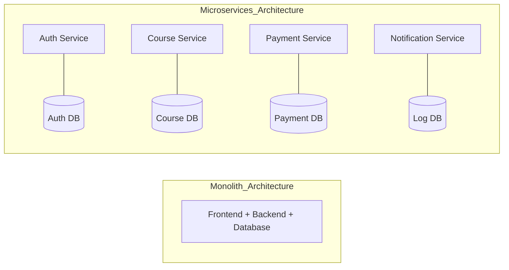
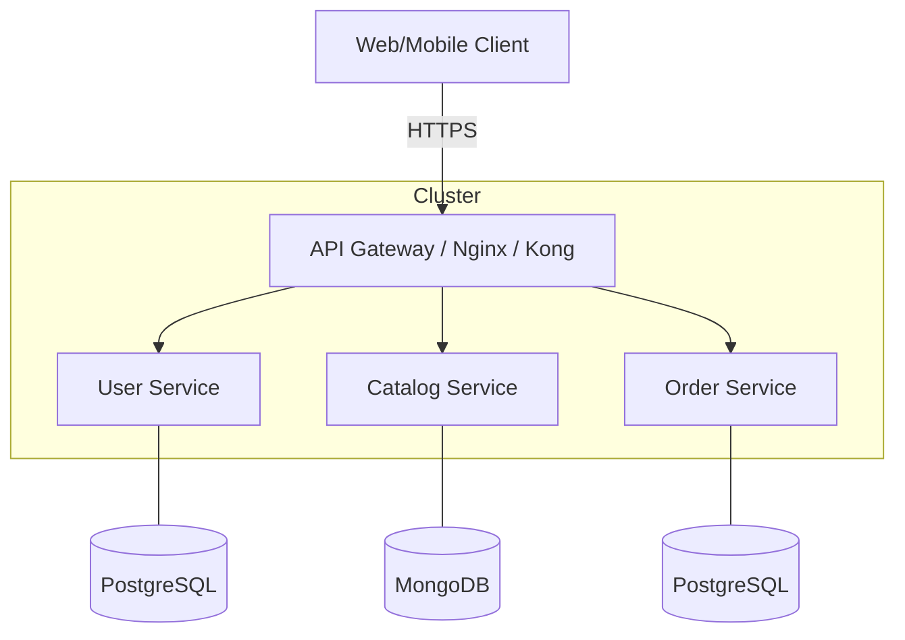
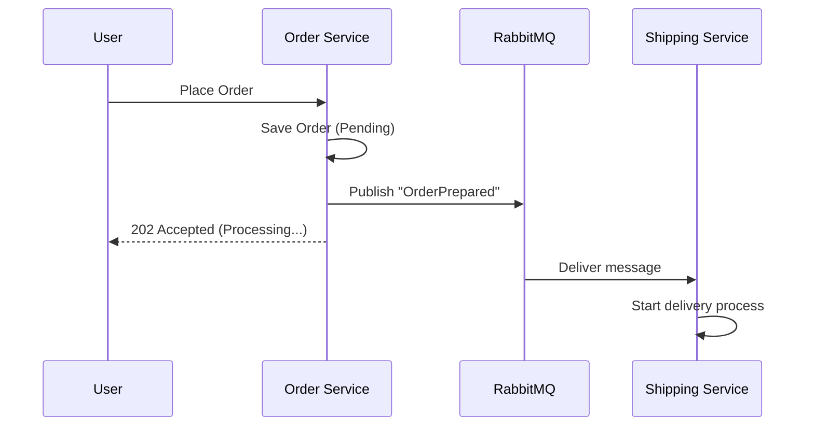
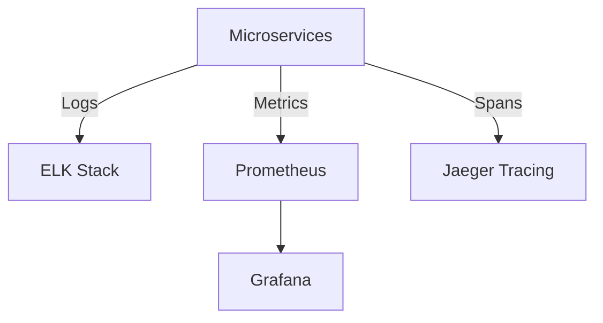

The landscape of software development has shifted dramatically over the last decade. We've moved from monolithic "do-it-all" applications to distributed, modular systems known as **Microservices**. But why? And more importantly, how do you design them effectively without creating a "distributed monolith" that is even harder to maintain?

In this comprehensive guide, we'll explore the core principles of microservices architecture, its advantages, the challenges it presents, the design patterns that make it successful in production, and how to build a career-defining portfolio project around these concepts.

## 1. The Genesis: From Monolith to Microservices

### The Monolithic Problem
In the early days of web development, the **Monolith** was king. A single codebase, a single executable, and a single database. For small projects, this is perfect. But as the system grows:
- **Scaling becomes inefficient:** You cannot scale only the "Payment" module; you must scale the whole app.
- **Technology lock-in:** Want to use Go for a CPU-intensive task but your monolith is Ruby? Good luck.
- **Cognitive Load:** New engineers take months to understand the spaghetti code.

### The Microservices Solution
Microservices solve this by breaking the application into small, independent services. Each service:
- Runs in its own process.
- Communicates with lightweight mechanisms (REST, gRPC, or Message Brokers).
- Is built around specific business capabilities.
- Is independently deployable.



## 2. Core Principles: The "Laws" of Microservices

To build microservices that actually work, you must adhere to these fundamental principles.

### A. Bounded Context (Domain Driven Design)
Borrowed from Eric Evans' *Domain Driven Design*, a Bounded Context defines a boundary within which a specific domain model is defined and applicable.
*Example:* A "Course" in the `Catalog Service` might just be a title and price. In the `Learning Service`, it includes progress tracks, quizzes, and certificates. They are technically the same entity but belong to different contexts.

### B. Independent Deployability
This is the litmus test. If you can't push a fix to Service A without affecting Service B, you don't have microservices. This requires strict API versioning and backward compatibility.

### C. Decentralized Data Management (Database per Service)
**Rule #1:** No shared database tables. If Service A needs data from Service B, it must:
1. Call Service B's API.
2. Listen to an event emitted by Service B and store a local copy of the data.

## 3. High-Level Design Patterns

Building microservices is like playing with Lego blocks—you need a blueprint to connect them.

### A. API Gateway Pattern
Instead of letting the client talk directly to 50 different microservices, an **API Gateway** acts as a single entry point.

**Responsibilities:**
- **Routing:** Directing `/api/v1/auth` to User Service.
- **Authentication:** Validating JWT tokens before they reach the services.
- **Rate Limiting:** Preventing DDoS attacks.
- **Load Balancing:** Distributing traffic across multiple instances.



### B. Service Discovery
How does Service A know the IP of Service B in a dynamic Kubernetes environment?
- **Client-Side Discovery:** Client queries a Service Registry (Consul, Eureka).
- **Server-Side Discovery:** (Standard in K8s) The client talks to a "Service" object which handles routing.

### C. Circuit Breaker
If Service B is failing, don't let it take down Service A. The Circuit Breaker "trips" and returns a fallback response until Service B is healthy.

## 4. Communication: Sync vs. Async

### Synchronous (REST/gRPC)
- **When to use:** When you need an immediate result (e.g., "Is this user's password correct?").
- **Trade-off:** High coupling. If the downstream service is slow, everyone is slow.

### Asynchronous (RabbitMQ / Kafka)
- **When to use:** When the action can happen "eventually" (e.g., "Send a welcome email after signup").
- **Trade-off:** Complexity. You have to handle "at-least-once" delivery and idempotent processing.



## 5. Data Consistency and the Saga Pattern

In microservices, you cannot use a simple "BEGIN TRANSACTION" across two databases. You use a **Saga**.

### Choreography Saga
Services talk to each other via events without a central coordinator.
*Example:* Order Service emits `OrderCreated`. Payment Service hears it and charges the card.

### Orchestration Saga
A central "Orchestrator" tells each service what to do.
*Example:* The Saga Manager tells Payment Service "Charge Card." If it fails, it tells Stock Service "Release Reserved Items."

## 6. Microservices Security: The Zero-Trust Model

In a distributed system, you shouldn't trust the internal network.

### A. JWT for Identity
The Gateway generates a signed JWT. Every service verifies this token locally.
```javascript
// Verification middleware example
const verifyToken = (req, res, next) => {
  const token = req.headers['authorization'];
  try {
    const decoded = jwt.verify(token, PUBLIC_KEY);
    req.user = decoded;
    next();
  } catch (err) {
    return res.status(401).send('Unauthorized');
  }
};
```

### B. Mutual TLS (mTLS)
Services must present a valid certificate to talk to each other. This is often handled by a **Service Mesh** like Istio or Linkerd.

## 7. Observability: Seeing through the Cloud

You cannot debug microservices with `console.log` on one machine. You need:

1.  **Distributed Tracing:** Every request gets a `TraceID` that follows it through all services.
2.  **Centralized Logging:** All logs pushed to a single place (ELK Stack: Elasticsearch, Logstash, Kibana).
3.  **Metrics:** Using Prometheus and Grafana to watch CPU, Memory, and Request counts.



## 8. Resilience and Chaos Engineering

Build for failure. Use "Chaos Engineering" (pioneered by Netflix) to intentionally break things in production.
- **Liveness Probes:** Restarts a container if it crashes.
- **Readiness Probes:** Removes a container from the load balancer if it's not ready to handle traffic.

## 9. Common Mistakes to Avoid (Anti-Patterns)

> [!CAUTION]
> Avoid the "Distributed Monolith" – where services are so coupled that you can't change one without the other.

- **Sharing a Database:** This is the most common death sentence for microservices.
- **Nano-services:** Breaking things down too small (e.g., a service for just "String Utility").
- **Ignoring Automation:** Trying to manage microservices without a robust CI/CD pipeline.

## 10. Conclusion: Why This Matters for Your Career

Understanding microservices isn't just about learning a new tool; it's about learning a new way of thinking. Companies like **Netflix, Amazon, Uber, and Grab** (The Unicorns) don't hire "Node.js developers." They hire **System Engineers** who understand how to build resilient, distributed systems.

By building a project that implements these patterns, you demonstrate that you can handle the scale and complexity of a multi-billion dollar platform.

> "Simplicity is a prerequisite for reliability."
> -- Edsger W. Dijkstra

### FAQ

<details>
<summary>Is Kubernetes required for microservices?</summary>
No, but it makes life 100x easier. You can use Docker Swarm or even just separate VPS instances, but K8s is the industry standard for a reason.
</details>

<details>
<summary>How do I handle shared code (Common Utils)?</summary>
Use a private NPM package or a Git Submodule. But be careful—if you change the shared code, you might force a synchronized deployment of all services.
</details>

<details>
<summary>What is the best language for microservices?</summary>
The beauty is you can use anything! Node.js is great for I/O, Go is great for concurrency/CPU, and Python is great for AI/Data.
</details>

_Thank you for reading this deep dive. Stay tuned for Part 2: Redis Caching at Scale._

_Written by **Khairil Rahman**._
