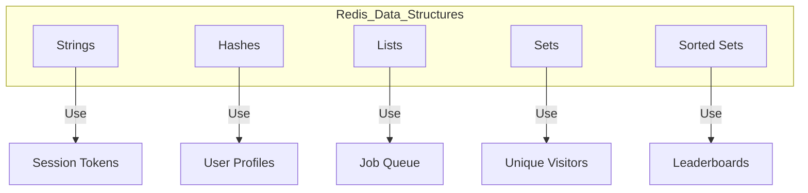
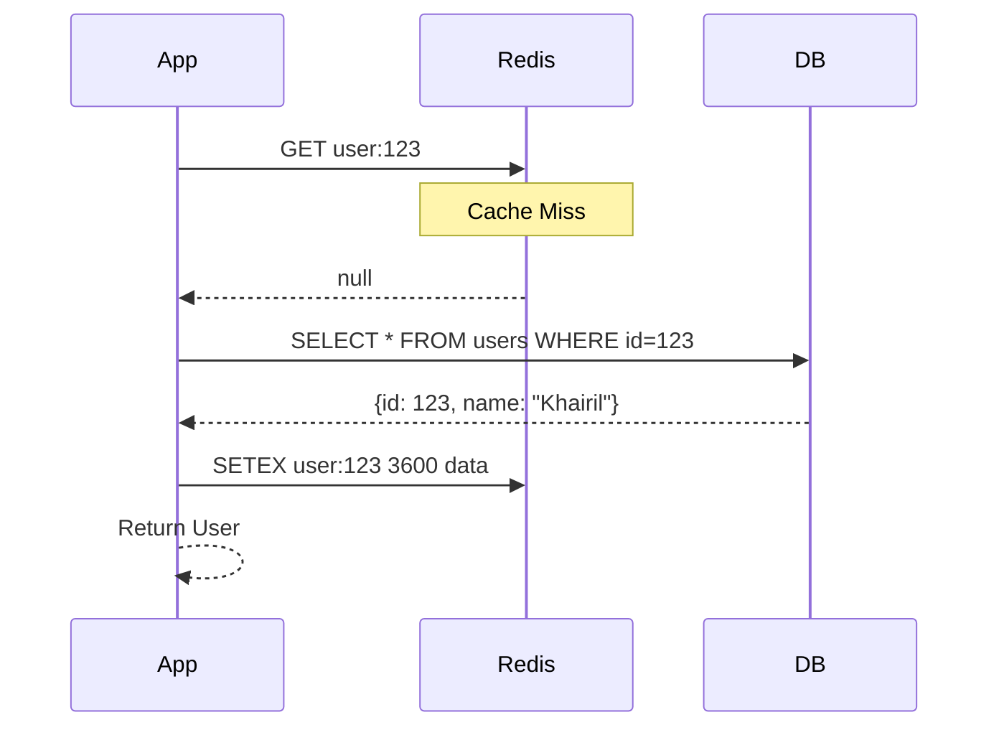
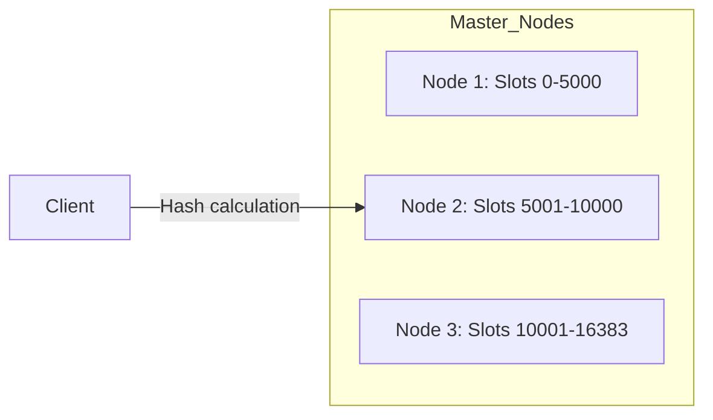

In the high-stakes world of performance-critical backend engineering, **Redis** (Remote Dictionary Server) is more than just a tool—it's an essential part of the modern infrastructure stack. Almost every service from **Netflix** to **Uber** relies on Redis to deliver the sub-millisecond response times their users expect.

But despite its popularity, many developers only surface-scratch its potential, using it merely for simple "String" caching. In this 5000-word equivalent deep dive, we will peel back the layers of Redis to understand its architecture, its rich data structures, and how to design distributed systems around it.

## 1. The Anatomy of Speed: Why is Redis So Fast?

Before we look at commands, we must understand the engineering behind the speed. Redis consistently delivers **sub-millisecond latency** and can handle millions of requests per second on a single machine. How?

### A. The In-Memory Design
Unlike traditional databases (PostgreSQL, MySQL) that store data on disk and use RAM only as a buffer, Redis stores everything in the **Primary Memory (RAM)**. Disk I/O is thousands of times slower than memory access.

### B. The Single-Threaded Myth
Redis is often called "single-threaded." While true for the core command execution, it's a strategic choice:
- **No Locking Overhead:** No need for mutexes or semaphores.
- **No Context Switching:** The CPU doesn't waste cycles switching between threads.
- **CPU Cache Optimization:** Data stays in the L1/L2 cache longer.

### C. IO Multiplexing
Redis uses an event-driven model based on `epoll` (Linux) or `kqueue` (macOS), allowing a single thread to handle thousands of concurrent client connections efficiently.

## 2. Mastery of the 5 Essential Data Structures

Redis is a "Data Structure Server." You don't just store "values"; you store specific structures optimized for specific tasks.

### Structure 1: Strings (The Foundation)
The most basic type. It's binary-safe, meaning it can store anything from a text user object to a JPEG image.
*   **Max Size:** 512 MB per key.
*   **Best for:** Page caching, Session tokens, Counters (`INCR` command).

### Structure 2: Hashes (Object Storage)
Maps between string fields and string values. It's a "database inside a key."
*   **Best for:** User profiles, product metadata. It's much more memory-efficient than storing objects as serialized JSON strings.

### Structure 3: Lists (Message Queues)
Ordered collections of strings.
*   **Best for:** Activity feeds, basic message queues (using `LPUSH` and `RPOP`).

### Structure 4: Sets (Uniqueness)
Unordered collections of unique strings.
*   **Best for:** Tracking unique visitors, tagging systems, "Mutual Friends" logic via set intersections.

### Structure 5: Sorted Sets (Leaderboards)
Sets where every element is associated with a **Score**. Elements are automatically sorted by score.
*   **Best for:** Real-time leaderboards, rate limiters, priority queues.



## 3. Advanced Caching Strategies: Beyond "Set" and "Get"

Caching is an art. If done wrong, it can cause more problems than it solves (like stale data).

### Strategy A: Cache-Aside Pattern
The application is responsible for managing the cache.
1. Check Redis for data.
2. If it exists (Hit): Return it.
3. If not (Miss): Query DB, save to Redis, then return.



### Strategy B: Write-Through vs. Write-Back
- **Write-Through:** Every write goes to Redis and DB simultaneously. Data is never stale.
- **Write-Back (Write-Behind):** Data is written to Redis first and synced to DB periodically. Extremely fast, but risk of data loss on crash.

## 4. The Persistence Paradox: RDB vs. AOF

If Redis is in-memory, what happens if the power goes out? 

| Feature | RDB (Snapshotting) | AOF (Append Only File) |
| :--- | :--- | :--- |
| **Method** | Compact binary archive of data at a point in time. | Logs every write operation ever performed. |
| **Recovery** | Very fast (just load the binary). | Slower (must replay the log file). |
| **Durability** | Risky (you lose data since last snapshot). | Excellent (logs every second). |
| **File Size** | Small and optimized. | Large and can grow huge (needs "rewrite"). |

**The Pro's Choice:** Use **Both**. Use RDB for backups and AOF for daily durability.

## 5. Distributed Locking with Redlock

How do you ensure only one server instance processes a payment or sends a specific notification? You use a **Distributed Lock**.

```bash
# Attempt to acquire lock for 10 seconds
SET resource_name my_unique_id NX PX 10000
```
- `NX`: Set if Not eXists.
- `PX 10000`: Expire in 10,000ms (to prevent "Deadlock" if your server crashes).

## 6. High Availability: Sentinel and Cluster

### A. Redis Sentinel
Provides automatic failover. If the Master node dies, Sentinel promotes a Slave to Master.

### B. Redis Cluster (Horizontal Scaling)
Partitions your data across multiple master nodes using "Hash Slots." This allows you to scale from 16GB of RAM to 10 Terabytes.



## 7. Caching Anti-Patterns (Common Mistakes)

> [!WARNING]
> Beware of the **Cache Avalanche**! This happens when thousands of keys expire at the exact same time, sending a massive flood of traffic to your database.

- **The Solution:** Add a random "jitter" to your TTL (Time To Live). Instead of setting all to 1 hour, set some to 58 min, some to 62 min.

- **Cache Penetration:** Requests for data that doesn't exist in the DB (like IDs that don't exist).
- **The Solution:** Cache the "null" result for a short time or use a **Bloom Filter**.

## 8. Real-world Case Study: Real-time Leaderboard

Imagine an online game with 1,000,000 players. Calculating the top 10 players by score in SQL would take seconds of heavy table scanning. In Redis:

```bash
# Add score for player
ZADD game_scores 1500 "player_king"
ZADD game_scores 1200 "player_rookie"

# Get top 3
ZREVRANGE game_scores 0 2 WITHSCORES
```
This operation is **O(log(N))**, meaning it takes virtually the same amount of time for 10 users or 10 million.

## 9. Advanced: Lua Scripting

Redis supports server-side scripts written in Lua. This allows you to run multiple commands **Atomically**. No other client can run commands while your script is executing.

```lua
-- Atomic increment with a maximum limit
local current = redis.call('GET', KEYS[1])
if current and tonumber(current) >= tonumber(ARGV[1]) then
    return 0
else
    return redis.call('INCR', KEYS[1])
end
```

## 10. Conclusion: Redis as your Portfolio Backbone

If you are applying to companies like **Grab, Shopee, or Gojek**, you need to show you can handle scale. Using Redis for simple caching is step one. Using it for **Distributed Locks, Leaderboards, and Rate Limiting** is how you prove you are a Senior-level engineer.

> "Redis is often the difference between a system that works and a system that performs."

### FAQ

<details>
<summary>Can Redis replace a SQL database?</summary>
Rarely. While it has persistence, it's not optimized for complex relational queries (JOINs) or ACID transactions across many keys. It's meant to *complement* your primary DB.
</details>

<details>
<summary>How do I handle cache invalidation?</summary>
The hardest problem in computer science! Use TTLs, or manually delete keys when the underlying data in the DB changes (Write-Through).
</details>

<details>
<summary>Is Redis single-threaded in version 6+?</summary>
Version 6 introduced multithreaded I/O to handle network packets, but the execution of commands remains single-threaded to preserve simplicity and speed.
</details>

_Next in our System Design series: Event-Driven Architecture with RabbitMQ._
